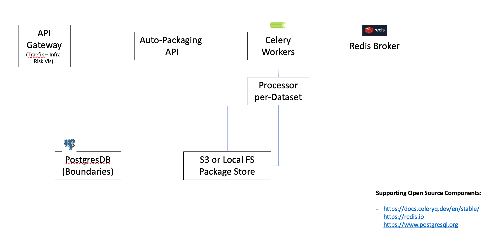
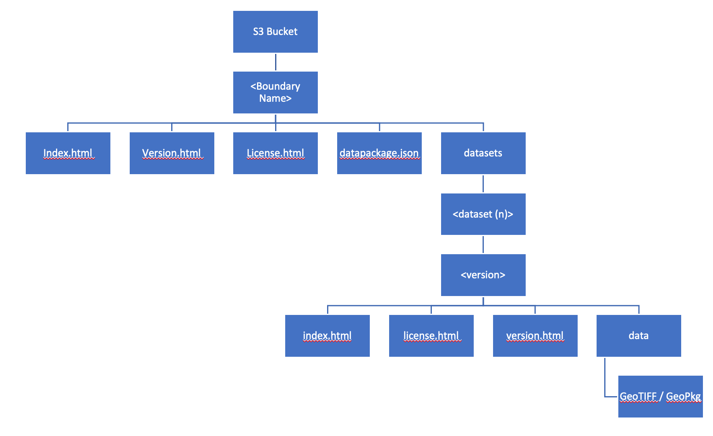

# IRV AutoPackaging

FastAPI + Celery for executing ETL (boundary clipping, re-formatting, move to S3/Local FS) against source datasaets hosted on https://global.infrastructureresilience.org (see also https://github.com/nismod/infra-risk-vis.)

Encompasses API and backend-processing to generate / manage frictionless-data datapackages associated with boundaries

## Architecture

<a href="url"></a>

## API

API Covering boundaries, processors, packages and processing job submission against packages.

The source of truth of package data for the API is the configured filesystem.

The API uses boiundaries loaded into a configured postgres database (see below).

### Boundaries

Boundaries are sourced by the API from a local PostGIS table.

To load the boundaries in the correct form you can use the helper script: `tests/data/load_boundaries.py <geojson filepath> <name column> <long_name column> <wip table true/false>`.

The boundaries table schema is managed by Alembic can be found under `api/db/models/boundary.py`.

**NOTE**: API Integration tests require a Db user who has RW access to this table.
**NOTE**: The configured API database will be wiped during running of the integration tests and loaded with test-boundaries.

#### PG Schema Management with Alembic

The database schema is managed through Alembic. The following serves as a guide to basic usage for extending the schema - refer to https://alembic.sqlalchemy.org/en/latest/ for more information.

##### Schema Updates

- Make changes as required to models
- From within the autopkg/api folder run the following to auto-generate an upgrade/downgrade script:

```bash
alembic revision --autogenerate -m "Added Boundary Table"
```

**NOTE**: CHECK the script - remove extraneous operations (in particular those relating to spatial-ref-sys)

- When ready run the following to upgrade the database:

```bash
# Ensure the AUTOPKG_POSTGRES_* env variables are set (see below)
cd api
alembic upgrade head
```

### Running Locally:

```bash
uvicorn api.main:app --host 0.0.0.0 --port 8000
```

Running using Docker:

```bash
docker-compose up api
```

### Documentation

API Docs: https://global.infrastructureresilience.org/extract/redoc

OpenAPI JSON: https://global.infrastructureresilience.org/extract/openapi.json

#### OpenAPI

- Run the app as above
- Navigate to http://`host`:`port`/openapi.json

#### ReDoc

- Run the app as above
- Navigate to http://`host`:`port`/redoc

## Data Processing

### Running

#### Locally

Data Processor:

```bash
celery --app dataproc.tasks worker
```

#### Docker Compose

See: `docker-compose.yaml`

```bash
docker-compose up dataproc
```

### Data Storage

Terms:

- `Package` - All Data associated with a single boundary
- `Processor` - Code for clipping a particular Dataset and Version
- `Processing Backend` - Processor execution environment. Currently only local filesystem processing backend is supported. (Processing interim files are executed against and stored-in the local execution env)
- `Storage Backend` - Package storage environment. Currently AWS S3 and LocalFS are supported. Package files are hosted from here, either using NGINX (see `docker-compose.yaml`) or S3.

#### Package Structure:

<a href="url"></a>

Processors will download and store source datafiles to a configured location on the local execution environment filesystem, on first-execution. (This means source files _could_ be downloaded multiple times if multiple Celery workers were deployed across seperate filesystems.)

Processor will generate interim files in a configured location on the local filesystem during processing of a boundary. These files are subsequently moved to the configured storage backend and deleted from temporary storage on processor exit.

### Processors

Dataset Core Processors (`dataproc/processors/core`) are executed as Celery Tasks and are responsible for fetching, cropping and moving the dataset-version to-which they are associated.

Supporting Internal Processors (`dataproc/processors/internal`) generate Boundary and folder-structures, as well as providing logging.

Celery tasks are constructued from API request and executed against source data. A processing request can only be executed against a single boundary, but can include multiple processors to be executed.

The overall task for each request is executed as a Chord, with a nested Group of tasks for each processor (which can run in parallel):

```python
dag = step_setup | group(processor_task_signatures) | step_finalise
```

The `step_setup` and `step_finalise` tasks are defined in `dataproc.tasks` and are responsible for setting up the processing environment and cleaning up after the processing has completed.

The `processor_task_signatures` are generated by the API and are responsible for executing the processing for each processor.

Duplicate execution of tasks is prevented by using a Redis-lock for a combination of boundary-dataset-version key. (see `dataproc/tasks.py`).

### Configuration

All config variables are parsed by `config.py` from the execution environment.

```bash
# Celery
AUTOPKG_LOG_LEVEL=DEBUG # API and Dataproc Logging Level
AUTOPKG_INTEGRATION_TEST_ENDPOINT="http://localhost:8000" # API Endpoint used during integration testing (integration testing deployment env)
AUTOPKG_REDIS_HOST="localhost" # Redis Host (APOI and Worker)
AUTOPKG_CELERY_BROKER="redis://localhost" # Used for Worker only
AUTOPKG_CELERY_BACKEND="redis://localhost" # Used in API and Worker
AUTOPKG_CELERY_CONCURRENCY=2 # Celery worker concurrency - dataproc only
AUTOPKG_TASK_LOCK_TIMEOUT=600 # Secs - Duplicate task lock timeout (blocks duplicate processors from executing for this time)
AUTOPKG_TASK_EXPIRY_SECS=43200 # Secs before queued tasks expire on Celery - dataproc only
GDAL_CACHEMAX=1024 # Siz eof GDAL Cache (mb) for raster crop operations - see GDAL Docs

# Postgres Boundaries
AUTOPKG_POSTGRES_USER= # Used for API Boundaries in Prod (and test natural_earth_vector processor in Worker)
AUTOPKG_POSTGRES_HOST= # Used for API Boundaries only (and test natural_earth_vector processor in Worker)
AUTOPKG_POSTGRES_PASSWORD= # Used for API Boundaries only (and test natural_earth_vector processor in Worker)
AUTOPKG_POSTGRES_PORT= # Used for API Boundaries only (and test natural_earth_vector processor in Worker)
AUTOPKG_POSTGRES_DB= # Used for API Boundaries only (and test natural_earth_vector processor in Worker)

# Deployment Env
AUTOPKG_DEPLOYMENT_ENV="prod" # Change to test when running integration tests.
AUTOPKG_S3_REGION="eu-west-2" # S3 region
AUTOPKG_STORAGE_BACKEND="awss3" # Either "awss3" or "localfs" Storage backend to use for final packages (see additional backend-specific flags below for more info).  Used in API and Worker

# Testing Backend
AUTOPKG_LOCALFS_STORAGE_BACKEND_ROOT_TEST="./tests/data/packages" # Root for backend storage folder in testing
AUTOPKG_LOCALFS_PROCESSING_BACKEND_ROOT_TEST="./tests/data/processing" # Root for backend processing folder in testing
AUTOPKG_S3_TEST_ACCESS_KEY= # S3 Access key for testing Bucket
AUTOPKG_S3_TEST_SECRET_KEY= # S3 Secret for testing bucket
AUTOPKG_S3_TEST_BUCKET="irv-autopkg-dev" # S3 Bucket for Dev / Testing

# Prod Backend
AUTOPKG_LOCALFS_STORAGE_BACKEND_ROOT="./data/packages" # Root for backend storage folder in Prod
AUTOPKG_LOCALFS_PROCESSING_BACKEND_ROOT="./data/processing" # Root for backend storage folder in Prod
AUTOPKG_S3_ACCESS_KEY= # S3 Access key for testing Bucket
AUTOPKG_S3_SECRET_KEY= # S3 Secret for testing bucket
AUTOPKG_S3_BUCKET="irv-autopkg" # S3 Bucket for Prod

# Testing Flags
AUTOPKG_INCLUDE_TEST_PROCESSORS="True" # Include Test Processors from the available processors list
AUTOPKG_TEST_GRI_OSM="True" # Integration tests which require access to the GRIOSM Postgres instance will be run if this is set-True (1)

AUTOPKG_PACKAGES_HOST_URL= # Root-URL to the hosting engine for package data. e.g. "https://global.infrastructureresilience.org/packages" (localfs) or "https://irv-autopkg.s3.eu-west-2.amazonaws.com" (awss3), or http://localhost (Local testing under NGINX)
```

#### Processor Specific Configurations

Some processors require their-own environment configuration(e.g. secrets for source data)

```bash
# AWS OSM / Damages DB
AUTOPKG_OSM_PGHOST=
AUTOPKG_OSM_PORT=
AUTOPKG_OSM_PGDATABASE=
AUTOPKG_OSM_PGUSER=
AUTOPKG_OSM_PGPASSWORD=
```

### Scaling

The primary means of scaling to fit available resources are:

```bash
GDAL_CACHEMAX=1024 # This flag limits the amount of memory GDAL uses when cropping rasters.  Mainly effects jrc_built_c processing because the input rasters are very large
AUTOPKG_CELERY_CONCURRENCY=2 # The number of tasks that can be executed at once.  Assume you'll get into the position of executing multiple very large crops / OSM cuts this number of times in parallel.  Smaller tasks will be queued behind these larger blocking tasks.
```

Also when running under docker-compose you can change the container resource limits in `docker-compose.yaml` to uit your execution environment.

**NOTE**: We have not yet extensively testsed running on a distributed-cluster (i.e. workers running on separate nodes). In Theory this is supported through Celery and the Redis backend, however the processor data-folder will need to be provided through some shared persistent storage to avoid pulliung source data multiple-times.

### Testing

#### DataProcessors

Integration tests in `tests/dataproc/integration/processors` all run standalone (without Redis / Celery), but you'll need access to the source data for each processor (see above).

**NOTE**: Test for geopkg (test_natural_earth_vector) loading include a load from shapefile to postgres - the API database is used for this test and configured user requires insert and delete rights on the api database for the test to succeed.

```bash
# Run tests locally
python -m unittest discover tests/dataproc
# Run tests in Docker
docker-compose run test-dataproc
```

#### API & DataProcessing End2End

**NOTE**: API and Dataproc tests required access to shared processing and package folders for assertion of processor outputs.

**NOTE**: API tests will add and remove boundary test-data to/from the Db during execution.

**NOTE**: API tests will add and remove package data to/from the configured packages directory during execution. Temporary processing data for `natural_earth_raster` will also be generated and removed from the configured processing backend folder.

**NOTE**: Dataproc will add and remove package data to/from the packages source tree during execution. Processors will also remove data from their configured temporary processing directoryies, depenign on how they are configured.

**NOTE**: Individual processor integration tests require access to source data to run successfully.

#### Locally

Ensure the Celery Worker, Redis, PG and API service running are running somewhere (ideally in an isolated environment as assets will be generated by the tests) if you want to run the integration tests successfully.

Ensure you also have `AUTOPKG_LOCALFS_STORAGE_BACKEND_ROOT_TEST` set in the environment, so both API and Celery worker can pickup the same package source tree

```bash
export AUTOPKG_DEPLOYMENT_ENV=test
# Run API
uvicorn api.main:app --host 0.0.0.0 --port 8000

# Run Worker
celery --app dataproc.tasks worker --loglevel=debug --concurrency=1

# Run tests locally
python -m unittest discover tests/dataproc
python -m unittest discover tests/api
```

#### Docker

Alter deployment env in .env file: `AUTOPKG_DEPLOYMENT_ENV=test`

```bash
docker-compose up -d db redis api dataproc
docker-compose run test-api
```

#### Localfs or S3 Backend

Altering deployment env with `AUTOPKG_STORAGE_BACKEND=awss3` or `AUTOPKG_STORAGE_BACKEND=localfs` will also mean tests run against the configured
backend.

**NOTE** awss3 integration tests require supplied access keys to have RW permissions on the configured bucket.

```bash
export AUTOPKG_STORAGE_BACKEND=awss3 && python -m unittest discover tests/dataproc
```

### Extending / New Processor Development

- Create a new folder for your dataset beneath `dataproc/processors/core` (e.g. `dataproc/processors/core/my_dataset`)
- Add a new Python-file for the dataset version within the folder (and supporting **init**.py). (e.g. `dataproc/processors/core/my_dataset/version_1.py`)
- Add a Metadata Class containing the processor-version metadata (which must sub-class MetadataABC), e.g.:

```python
class Metadata(BaseMetadataABC):
    """Processor metadata"""
    description = "A test processor for nightlights"  # Longer processor description
    dataset_name = "nightlights"  # The dataset this processor targets
    data_author = "Nightlights Author"
    data_title = ""
    data_title_long = ""
    data_summary = ""
    data_citation = ""
    data_license = DataPackageLicense(
        name="CC-BY-4.0",
        title="Creative Commons Attribution 4.0",
        path="https://creativecommons.org/licenses/by/4.0/",
    )
    data_origin_url = "http://url"
    data_formats = ["GeoTIFF"]
```

- Add a Processor Class (which must sub-class BaseProcessorABC so it can be run by the global Celery Task), which runs the fetching, cropping and moving logic for your dataset-version. (**NOTE**: Helper methods are already provided for the majority of tasks - e.g. Storage backend classes are provided for LocalFS and AWSS3), e.g.:

```python
class Processor(BaseProcessorABC):
    """A Test Processor"""

    def generate(self):
        """Generate files for a given processor"""
        self.update_progress(30,"waiting")
        output_folder = os.path.join(
            self.processing_root_folder, "test_processor", self.metadata.version, "outputs"
        )
        output_fpath = os.path.join(output_folder, f"{self.boundary['name']}_test.tif")

        # Generate a blank tests dataset
        create_test_file(output_fpath)
        result_uri = self.storage_backend.put_processor_data(
            output_fpath,
            self.boundary["name"],
            self.metadata.name,
            self.metadata.version,
        )
        self.provenance_log[f"{self.metadata.name} - move to storage success"] = True
        self.provenance_log[f"{self.metadata.name} - result URI"] = result_uri
        # Generate the datapackage and add it to the output log
        hashes, sizes = self.calculate_files_metadata([output_fpath])
        datapkg = datapackage_resource(
            self.metadata,
            [result_uri],
            "GEOPKG",
            sizes,
            hashes,
        )
        self.provenance_log["datapackage"] = datapkg.asdict()

        return self.provenance_log

    def exists(self):
        """Whether all files for a given processor exist on the FS on not"""
        return self.storage_backend.processor_file_exists(
            self.boundary["name"],
            self.metadata.name,
            self.metadata.version,
            f"{self.boundary['name']}_test.tif",
        )
```

- Write tests against the new Processor (see: `tests/dataproc/integration` for examples)
- Rebuild image and deploy: The API will expose any valid processor-folder placed under the `dataproc/core` folder.

## Acknowledgments

This research received funding from the FCDO Climate Compatible Growth Programme. The views expressed here do not necessarily reflect the UK government's official policies.
