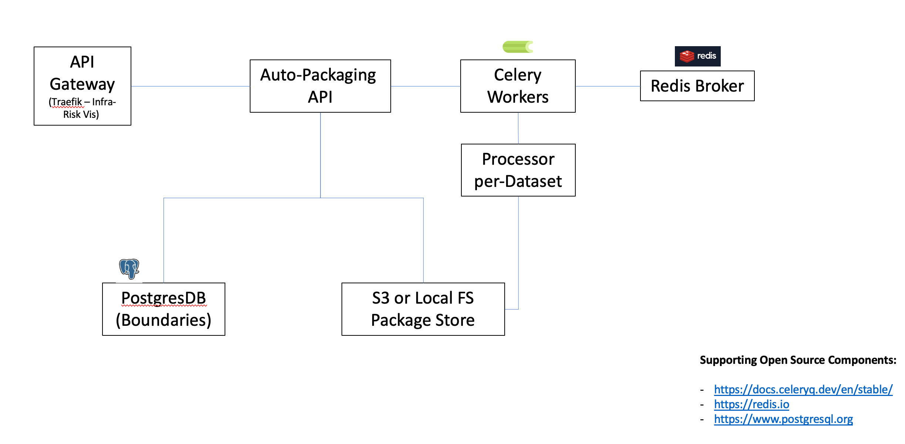
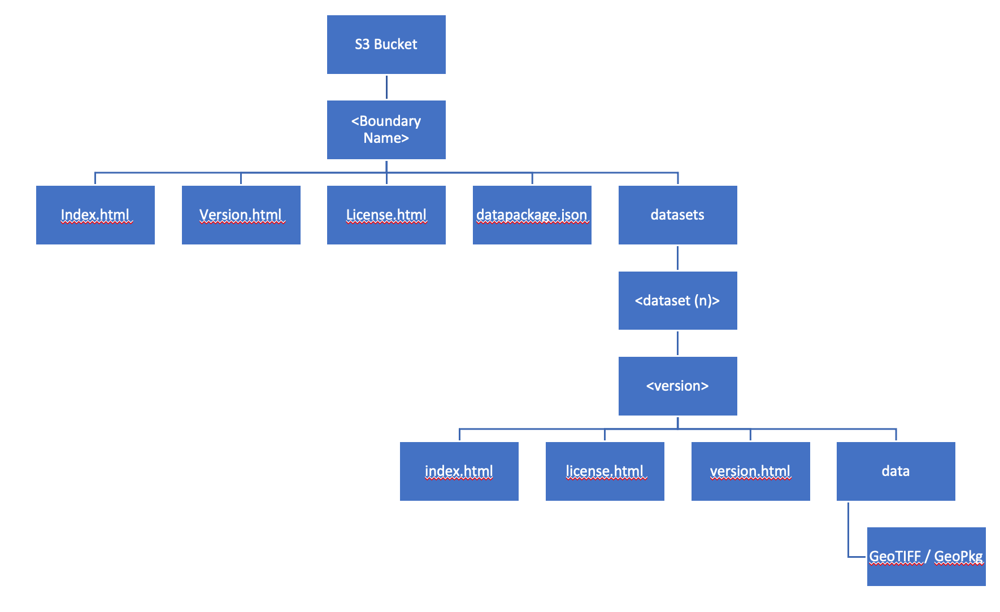

# IRV AutoPackaging

FastAPI service hosted on https://global.infrastructureresilience.org (see also
https://github.com/nismod/infra-risk-vis.)

Encompasses API and backend storage to find and access frictionless-data
datapackages associated with boundaries

## Architecture

<a href="url"></a>

## API

API covers boundaries and packages.

The source of truth of package data for the API is the configured filesystem.

The API uses boundaries loaded into a configured postgres database (see below).

### Boundaries

Boundaries are sourced by the API from a local PostGIS table.

To load the boundaries in the correct form you can use the helper script:
`tests/data/load_boundaries.py <geojson filepath> <name column> <long_name
column> <wip table true/false>`.

The boundaries table schema is managed by Alembic can be found under
`api/db/models/boundary.py`.

**NOTE**: API Integration tests require a Db user who has RW access to this
table.

**NOTE**: The configured API database will be wiped during running of the
integration tests and loaded with test-boundaries.

#### PG Schema Management with Alembic

The database schema is managed through Alembic. The following serves as a guide
to basic usage for extending the schema - refer to
https://alembic.sqlalchemy.org/en/latest/ for more information.

##### Schema Updates

- Make changes as required to models
- From within the autoppkg/api folder run the following to auto-generate an
  upgrade/downgrade script:

```bash
alembic revision --autogenerate -m "Added Boundary Table"
```

**NOTE**: CHECK the script - remove extraneous operations (in particular those
relating to spatial-ref-sys)

- When ready run the following to upgrade the database:

```bash
# Ensure the AUTOPKG_POSTGRES_* env variables are set (see below)
cd api
alembic upgrade head
```

### Running Locally:

```bash
uvicorn api.main:app --host 0.0.0.0 --port 8000
```

Running using Docker, for example to run services in the background and
build/run/stop the API container:

```bash
# Run background services
docker compose -f docker-compose.yaml up -d db
# Build API container
docker compose -f docker-compose.yaml build api
# Run API container
docker compose -f docker-compose.yaml up api
# Logs printed directly to terminal
# CTRL-C to stop
```

### Documentation

API Docs: https://global.infrastructureresilience.org/extract/redoc

OpenAPI JSON: https://global.infrastructureresilience.org/extract/openapi.json

#### OpenAPI

- Run the app as above
- Navigate to http://`host`:`port`/openapi.json

#### ReDoc

- Run the app as above
- Navigate to http://`host`:`port`/redoc

## Data Storage

Terms:

- `Package` - All Data associated with a single boundary
- `Storage Backend` - Package storage environment. Currently AWS S3 and LocalFS
  are supported. Package files are hosted from here, either using NGINX (see
  `docker-compose.yaml`) or S3.

#### Package Structure:

<a href="url"></a>

### Configuration

All config variables are parsed by `config.py` from the execution environment.

```bash
# Celery
AUTOPKG_LOG_LEVEL=DEBUG # API and Dataproc Logging Level
AUTOPKG_INTEGRATION_TEST_ENDPOINT="http://localhost:8000" # API Endpoint used during integration testing (integration testing deployment env)

# Postgres Boundaries
AUTOPKG_POSTGRES_USER= # Used for API Boundaries in Prod (and test natural_earth_vector processor in Worker)
AUTOPKG_POSTGRES_HOST= # Used for API Boundaries only (and test natural_earth_vector processor in Worker)
AUTOPKG_POSTGRES_PASSWORD= # Used for API Boundaries only (and test natural_earth_vector processor in Worker)
AUTOPKG_POSTGRES_PORT= # Used for API Boundaries only (and test natural_earth_vector processor in Worker)
AUTOPKG_POSTGRES_DB= # Used for API Boundaries only (and test natural_earth_vector processor in Worker)

# Deployment Env
AUTOPKG_DEPLOYMENT_ENV="prod" # Change to test when running integration tests.
AUTOPKG_S3_REGION="eu-west-2" # S3 region
AUTOPKG_STORAGE_BACKEND="awss3" # Either "awss3" or "localfs" Storage backend to use for final packages (see additional backend-specific flags below for more info).  Used in API and Worker

# Testing Backend
AUTOPKG_LOCALFS_STORAGE_BACKEND_ROOT_TEST="./tests/data/packages" # Root for backend storage folder in testing
AUTOPKG_LOCALFS_PROCESSING_BACKEND_ROOT_TEST="./tests/data/processing" # Root for backend processing folder in testing
AUTOPKG_S3_TEST_ACCESS_KEY= # S3 Access key for testing Bucket
AUTOPKG_S3_TEST_SECRET_KEY= # S3 Secret for testing bucket
AUTOPKG_S3_TEST_BUCKET="irv-autopkg-dev" # S3 Bucket for Dev / Testing

# Prod Backend
AUTOPKG_LOCALFS_STORAGE_BACKEND_ROOT="./data/packages" # Root for backend storage folder in Prod
AUTOPKG_LOCALFS_PROCESSING_BACKEND_ROOT="./data/processing" # Root for backend storage folder in Prod
AUTOPKG_S3_ACCESS_KEY= # S3 Access key for testing Bucket
AUTOPKG_S3_SECRET_KEY= # S3 Secret for testing bucket
AUTOPKG_S3_BUCKET="irv-autopkg" # S3 Bucket for Prod

AUTOPKG_PACKAGES_HOST_URL= # Root-URL to the hosting engine for package data. e.g. "https://global.infrastructureresilience.org/packages" (localfs) or "https://irv-autopkg.s3.eu-west-2.amazonaws.com" (awss3), or http://localhost (Local testing under NGINX)
```

### Testing

#### DataProcessors

Integration tests in `tests/dataproc/integration/processors` all run standalone
(without Redis / Celery), but you'll need access to the source data for each
processor (see above).

**NOTE**: Test for geopkg (test_natural_earth_vector) loading include a load
from shapefile to postgres - the API database is used for this test and
configured user requires insert and delete rights on the api database for the
test to succeed.

```bash
# Run tests locally
python -m unittest discover tests/dataproc
# Run tests in Docker
docker-compose run test-dataproc
```

#### API & DataProcessing End to End

API and Dataproc tests required access to shared processing and package folders
for assertion of processor outputs.

API tests will add and remove boundary test-data to/from the Db during
execution.

API tests will add and remove package data to/from the configured packages
directory during execution. Temporary processing data for `natural_earth_raster`
will also be generated and removed from the configured processing backend
folder.

#### Locally

Ensure the PG and API service running are running somewhere (ideally in an
isolated environment as assets will be generated by the tests) if you want to
run the integration tests successfully.

Ensure you also have `AUTOPKG_LOCALFS_STORAGE_BACKEND_ROOT_TEST` set in the
environment, so the API can pick up the same package source tree

```bash
export AUTOPKG_DEPLOYMENT_ENV=test
# Run API
uvicorn api.main:app --host 0.0.0.0 --port 8000

# Run Worker
celery --app dataproc.tasks worker --loglevel=debug --concurrency=1

# Run tests locally
python -m unittest discover tests/dataproc
python -m unittest discover tests/api
```

#### Docker

Alter deployment env in .env file: `AUTOPKG_DEPLOYMENT_ENV=test`

```bash
docker-compose up -d db api dataproc
docker-compose run test-api
```

#### Localfs or S3 Backend

Altering deployment env with `AUTOPKG_STORAGE_BACKEND=awss3` or
`AUTOPKG_STORAGE_BACKEND=localfs` will also mean tests run against the
configured backend.

**NOTE** awss3 integration tests require supplied access keys to have RW
permissions on the configured bucket.

```bash
export AUTOPKG_STORAGE_BACKEND=awss3 && python -m unittest discover tests/dataproc
```

## Acknowledgments

This research received funding from the FCDO Climate Compatible Growth
Programme. The views expressed here do not necessarily reflect the UK
government's official policies.
